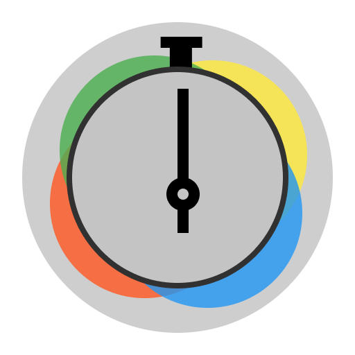
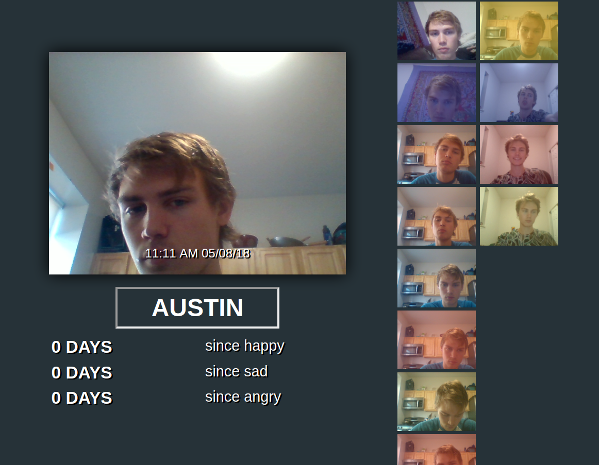
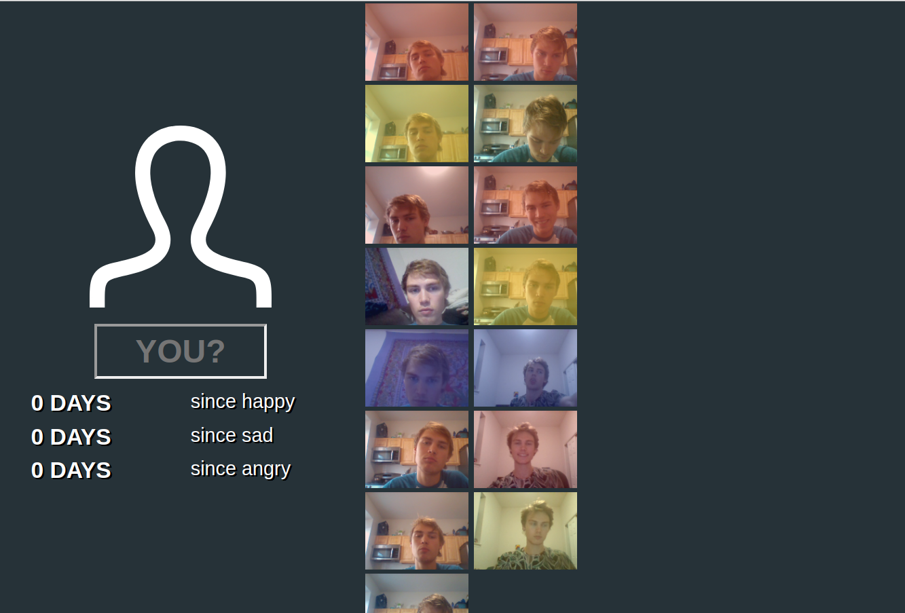

  

  
  

# Overtime

Day-to-day emotions are too easily forgotten about. Don't let them escape.
_Overtime_ is a Chrome extension that help you keep track of your emotions when you
least expect it. Well, ok, when you forget opening a new tab.

## Screenshots

  

  
 

  

## Requirements
* Node >= 8 

## Thanks to

* [CLM Tracker](https://github.com/auduno/clmtrackr/)
* [tracking.js](https://github.com/eduardolundgren/tracking.js)
* [Iconmonstr](https://iconmonstr.com/)
